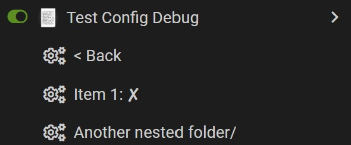

# `GM_config`

[English](./README.md) | 简体中文

[](https://github.com/PRO-2684/GM_config/releases)
[](https://greasyfork.org/rails/active_storage/blobs/redirect/eyJfcmFpbHMiOnsibWVzc2FnZSI6IkJBaHBBaWZvIiwiZXhwIjpudWxsLCJwdXIiOiJibG9iX2lkIn19--10e04ed7ed56ae18d22cec6d675b34fd579cecab/wechat.jpeg?locale=zh-CN)
[](https://github.com/PRO-2684/GM_config/)

简单而又强大的用户脚本配置库。 ([GitHub](https://github.com/PRO-2684/GM_config) | [Greasy Fork](https://greasyfork.org/scripts/470224))

## 🎉 特性

- 利用了用户脚本管理器所提供的 **配置菜单**
- 配置修改后 **自动更新菜单**（无论由用户或脚本修改）
- 支持 **监听配置获取/修改事件**
- 支持 **多标签页同步**
- 支持 **文件夹**（嵌套配置项）
- 自动/手动注册菜单
- **自定义** 程度高
    - 自定义配置输入方式 (`prop.input`)
    - 自定义输入数据处理方式 (`prop.processor`)
    - 自定义菜单项展现方式 (`prop.formatter`)
- 自动删除与默认值相同的用户配置，降低存储开销

<details><summary>🖼️ 示例截图</summary>



</details>

## 🤔 先决条件

这个库需要以下权限：

- `GM_setValue`: 保存配置
- `GM_getValue`: 获取配置
- `GM_deleteValue`: 自动删除配置 (可选，给予后库会自动删除与默认值相同的用户配置)
- `GM_registerMenuCommand`: 注册菜单
- `GM_unregisterMenuCommand`: 更新菜单
- `GM_addValueChangeListener`: 监听配置变化

你可以从以下几种方法中选择一种，以将此库包含在你的脚本中：

| Source         | Original | Minified |
| -------------- | -------- | -------- |
| [GitHub Release](https://github.com/PRO-2684/GM_config/releases) | 🟢      | 🟢       |
| [GitHub Raw](https://github.com/PRO-2684/GM_config/blob/main/config.js)     | 🟢      | 🔴       |
| [GreasyFork](https://greasyfork.org/scripts/470224)     | 🔴      | <span title="每天检查一次更新">🟡*</span>      |

GitHub Release (Minified) 是最推荐的源。以此为例，你可以像这样将此库包含在你的脚本中：

```javascript
// @grant        GM_setValue
// @grant        GM_getValue
// @grant        GM_deleteValue
// @grant        GM_registerMenuCommand
// @grant        GM_unregisterMenuCommand
// @grant        GM_addValueChangeListener
// @require      https://github.com/PRO-2684/GM_config/releases/download/<version>/config.min.js
```

其中 `<version>` 是你想要使用的版本 (例如 `v1.2.0`)。若只作测试用，你也可以直接 `@require` [最新版](https://github.com/PRO-2684/GM_config/releases/latest/download/config.min.js)。

若你想将脚本发布到 GreasyFork 等网站，你可能需要添加 [**子资源完整性** 检查](https://www.tampermonkey.net/documentation.php#api:Subresource_Integrity)。只需在 `@require` 的 URL 后添加 `#md5=<md5>`，其中 `<md5>` 是文件的 MD5 哈希值。你可以在发布页面找到计算的哈希值。

## 🚀 快速开始

首先，你需要一个 `Object` 来描述你的配置的结构。这被称为“配置描述”。以下是一个简单的例子：

```javascript
const configDesc = {
    price: { // 配置项 id，也被称为 "prop"
        name: "Price", // 显示名称
        type: "int", // 配置项类型
        value: 100 // 默认值
    },
    name: {
        name: "Name",
        type: "str",
        value: "John Doe"
    },
};
```

你可能想要限制整数的范围。没问题，你可以使用 `min` 和 `max` 属性来实现：

```javascript
const configDesc = {
    price: {
        name: "Price",
        type: "int",
        value: 100,
        min: 1, // 世界上没有免费的午餐
        max: 1000 // 无法承受的价格
    },
    // ...
};
```

这样，你就把这个值的范围限制在了 $[1, 1000]$。另外，你可能想要一个布尔值，或者说开关。不用担心，我们已经为你做好了准备 - 只需要将 `type` 设置为 `"bool"` 即可。有关支持的类型及其用法的完整列表，请参阅 [文档](#proptype)。

定义好配置描述后，是时候该注册它了。你可以这样做：

```javascript
const config = new GM_config(configDesc); // 注册配置菜单
```

十分简单，对吧？现在，你可以开始使用这个配置了。通常来说，你会想要 **查询** 配置，在特定的情景下会想要 **修改** 配置，并且为了动态响应要 **监听** 配置的变化。你可以这样做：

```javascript
console.log(config.get("price")); // 查询配置
config.set("price", 100); // 修改配置 (展示的菜单项会自动更新)
config.addEventListener("set", (e) => {
    const { prop, before, after } = e.detail;
    console.log(`配置项 ${prop} 从 ${before} 更改为 ${after}`);
});
```

现在你已经成功地为脚本设置了一个简单的配置菜单，是时候深入 [文档](#-文档) 以探索更高级的功能了。

## 📖 文档

### 确认版本

```javascript
console.log(GM_config.version); // *输出版本*
```

### 配置描述

使用这个库的第一步是创建一个配置描述。配置描述是一个字典，它的每个属性 (除了可能的 `$default` 外) 都是一个配置项的 id。需要注意的是，不允许 `.` 出现在配置项的 id 中。

#### `$default`

通过使用 `$default`，你可以方便地创建大量相同类型的配置项。若未在配置描述中提供 `$default`，则会对配置项中未指定的属性使用如下值：

```javascript
{ // 优先级：最低
    input: "prompt",
    processor: "same",
    formatter: "normal"
}
```

若你想要修改默认值，你可以在配置描述中提供 `$default` 从而覆盖上述默认值。需要注意的是：在这里指定 `prop.type` 并不会生效；子文件夹会 **继承** `$default` 属性。例如：

```javascript
const configDesc = {
    "$default": { // 优先级：低
        value: true,
        input: "current",
        processor: "not",
        formatter: "boolean"
    },
    switch_true: {
        name: "Switch true"
    },
    switch_false: {
        name: "Switch false",
        value: false // 优先级：最高
    }
}
```

但是，通常来说，后续提到的 `prop.type` 才是用于创建相似配置项的最佳选择，而 `$default` 只被用于将 `autoClose` 设置为 `false`：

```javascript
const configDesc = {
    "$default": {
        autoClose: false
    },
    // ...
}
```

#### `prop.type`

配置项的类型，用于快速设置常见的属性集。当前支持的类型有：

- `str`：字符串，默认为 `""`
- `bool`：布尔值，默认为 `false`
- `int`：整数，默认为 `0`
    - 若指定 `prop.min`，则检查值是否大于等于 `prop.min`
    - 若指定 `prop.max`，则检查值是否小于等于 `prop.max`
- `float`：浮点数，默认为 `0.0`
    - 若指定 `prop.min`，则检查值是否大于等于 `prop.min`
    - 若指定 `prop.max`，则检查值是否小于等于 `prop.max`
- `enum`：枚举
    - `prop.options`：一个字符串数组，代表一系列所展示的可选值，默认为 `["A", "B", "C"]`
    - 用户可以通过点击菜单项，在选项间循环切换
    - 值得注意的是，`prop.options` 只是在用户视角下的展示，实际上配置项所使用的值是此数组的 **索引**（从 0 至 `prop.options.length - 1` 循环）
    - 你应该给 `prop.value` 设置一个小于 `prop.options.length` 的非负整数，若未指定则默认为 `0`
- `action`：点击时调用函数
    - 你不应该覆盖此类型的 `prop.input` 和 `prop.processor` 属性
    - 为实现回调，请使用 `config.addEventListener` 监听此属性的 `get` 事件
- `folder`：一个含有其它配置项的文件夹
    - 你需要覆盖 `prop.items` 来在文件夹下创建配置项，其格式与顶层配置描述 `configDesc` 相同
    - 你可以在文件夹内使用 `$default`
    - 你可以随你喜欢嵌套任意多的文件夹
    - 通过 `prop.folderDisplay` 来控制文件夹的展现方式
        - `prefix`：子文件夹名称前缀，默认为空字符串
        - `suffix`：子文件夹名称后缀，默认为 ` >`
        - `parentText`：返回上一级的文本，默认为 `< Back`
        - `parentTitle`：返回上一级的标题，默认为 `Return to parent folder`
    - 通过句点访问嵌套的配置项，例如：
        - `config.get("folder1.folder2.item")`
        - `config.proxy["folder1.folder2.item"]`
        - `config.proxy.folder1.folder2.item`
        - `config.proxy["folder1.folder2"].item`

你可以像这样使用它们：

```javascript
const configDesc = {
    switch_true: {
        name: "Switch true",
        type: "bool" // 优先级：高
    },
    switch_false: {
        name: "Switch false",
        type: "bool", // 优先级：高
        value: false // 优先级：最高
    }
}
```

#### `prop.name`

配置项的显示名称。必须提供一个字符串。

#### `prop.value`

配置项的默认值，可以是任意值。你需要考虑其合法性，因为此库不会验证默认值的合法性。

#### `prop.input`

> `(prop, orig, desc) => input`

配置项的输入方式。可以提供一个字符串（内置输入方式），也可以是一个自定义函数（当菜单项被点击时触发）。若 `prop.input` 和 `$default.input` 均未指定，将使用 `prompt`，即弹出对话框询问输入。注意，“用户输入值”也可以实际上并非由用户输入，而是由脚本提供的。例如内置输入方式 `current`。

此函数的参数如下：

- `prop`：配置项的 id
- `orig`：当前值
- `desc`：此配置项的配置描述（`desc.` 与 `prop.` 表达的含义相同）

内置输入函数：

- `prompt`：弹出对话框询问输入（默认）
- `current`：使用当前值作为输入（常与 `prop.processor=not` 配合使用，用于开关；或与自定义的 `processor` 配合使用，构成生成器）
- `action`：派发 `get` 事件，返回原值（内部用于 `action` 类型）
- `folder`：进入由配置项 id 指定的文件夹。在此之后，派发 `get` 事件，返回原值（内部用于 `folder` 类型）

#### `prop.processor`

> `(prop, input, desc) => stored`

处理用户输入值，返回应被存储的值。可以提供一个字符串（内置处理器），也可以是一个自定义函数。若用户输入的值不合法，处理器应该**抛出错误**。若 `prop.processor` 和 `$default.processor` 均未指定，将默认使用 `same` 处理器，即直接返回用户输入。常见的使用情况是将用户输入的字符串转换为整数或者浮点数。

此函数的参数如下：

- `prop`：配置项的 id
- `input`：用户输入的值
- `desc`：此配置项的配置描述

内置处理器：

- `same`：直接返回用户输入的字符串
- `not`：取反（常与 `prop.input=current` 配合使用，用于开关）
- `int`：转换为在范围内的整数（若指定）
    - 若指定 `prop.min`，则检查值是否大于等于 `prop.min`
    - 若指定 `prop.max`，则检查值是否小于等于 `prop.max`
- `float`：转换为在范围内的浮点数（若指定）
    - 若指定 `prop.min`，则检查值是否大于等于 `prop.min`
    - 若指定 `prop.max`，则检查值是否小于等于 `prop.max`
- `enum`：向输入加 1 并关于 `prop.options.length` 取模（内部用于 `enum` 类型）

#### `prop.formatter`

> `(prop, value, desc) => string`

控制菜单项的显示文本。展现方式可以是一个字符串（内置展现方式），也可以是一个自定义函数。若 `prop.formatter` 和 `$default.formatter` 均未指定，则使用 `normal` 展现方式。

此函数的参数如下：

- `prop`：配置项的 id
- `value`：配置项的值
- `desc`：此配置项的配置描述

内置展现方式：

- `normal`：以 `name: value` 的形式展现
- `boolean`：针对布尔值的展现方式 - `true` 显示为 `name: ✔`，`false` 显示为 `name: ✘`
- `enum`：以 `name: option` 的形式展现，其中 `option` 为 `prop.options[value]`（内部用于 `enum` 类型）
- `name_only`: 仅显示名称，不显示值（内部用于 `action` 类型）
- `folder`: 使用 `prop.folderDisplay.prefix` 和 `prop.folderDisplay.suffix` 包裹名称（内部用于 `folder` 类型）

#### `prop.hidden`

> `boolean`

是否隐藏此配置项。若设为 `true`，则不会在菜单中显示此配置项，但是你仍然可以通过 `config.get` 和 `config.set` 来访问或修改它。

#### 其它 Tampermonkey 提供的属性

支持 `prop.accessKey`, `prop.autoClose`, `prop.title` (要求 TM >=4.20.0)。如果提供的是一个函数，那么它将被调用，传入参数为 `prop`, `value` 和 `desc`，就像自定义 `prop.formatter` 一样。它的返回值将被传递给 Tampermonkey。详细信息请参考 [Tampermonkey 文档](https://www.tampermonkey.net/documentation.php#api:GM_registerMenuCommand)。

#### 优先级

属性的优先级如下（从高到低）：

1. 你为配置项明确设置的属性
2. `type` 隐含的属性
3. 你为此文件夹的 `$default` 设置的属性
4. 计算后父文件夹的 `$default`
5. `$default` 的默认值

### 注册配置菜单

当你创建了一个配置描述后，你可以使用 `GM_config` 构造函数来将其注册为配置菜单。它接受如下两个参数：

- `configDesc`：配置描述
- `options`：选项（可选）
    - `immediate`：是否立即注册菜单
        - 若为 `true`，则会立即注册菜单（默认）
        - 若为 `false`，需要用户点击 `Show configuration` 后才会注册配置菜单
    - `debug`：是否开启调试模式。若为 `true`，会输出调试信息。默认为 `false`。（随时可以通过 `config.debug` 来修改）

```javascript
const config = new GM_config(configDesc, { immediate: false }); // *注册配置菜单*
console.log(config.get("price")); // *可以开始使用了 🎉*
```

### 查询/修改/枚举配置

当你注册了一个配置菜单后，你就可以通过调用 `.get(prop)`, `.set(prop, value)` 以及 `.list(path)` 分别来查询/修改/枚举配置。例如：

```javascript
console.log(config.get("price")); // *查询配置*
config.set("price", 100); // *修改配置* (菜单项会自动更新)
console.log(config.list("someFolder.folder")); // *枚举 someFolder.folder 下的配置项*
```

或者，你也可以通过 `config.proxy` 来查询/修改/枚举配置。例如：

```javascript
console.log(config.proxy.price); // *查询配置*
config.proxy.price = 100; // *修改配置* (菜单项会自动更新)
// *枚举 someFolder.folder 下的配置项*
for (const [prop, value] of Object.entries(config.proxy.someFolder.folder)) {
    console.log(prop, value);
}
console.log(Object.keys(config.proxy.someFolder.folder));
```

由于 id 中不允许出现 `.` 字符，你也可以这么访问：

```javascript
console.assert(config.proxy["someFolder.folder"].nothing === config.proxy.someFolder.folder.nothing);
```

### 监听配置的查询/修改

你可以通过调用 `config.addEventListener(type, listener, options?)` 来监听配置的查询/修改：

```javascript
config.addEventListener("set", (e) => {
    console.log(e.detail); // *配置被修改*
});
config.addEventListener("get", (e) => {
    console.log(e.detail); // *配置被查询*
});
```

`e.detail` 对象的属性如下：

- `prop`：被查询/修改的配置项的 id。使用句点表示嵌套的配置项。
- `before`：变更前的值。
- `after`：变更后的值。
- `remote`：表名此修改是否由其它脚本实例造成的，`get` 事件中此属性总为 `false` (无法检测其它脚本实例获取配置)。

需要注意的是：

- `get` 事件仅在当前脚本实例获取配置时触发
- `set` 事件会在 *任意来源* 修改配置时触发，而这使得多标签页同步成为可能

正如你所想，你可以通过 `config.removeEventListener(type, listener, options?)` 来移除监听器。这两个接口就是从 [`EventTarget.addEventListener`](https://developer.mozilla.org/zh-CN/docs/Web/API/EventTarget/addEventListener) 和 [`EventTarget.removeEventListener`](https://developer.mozilla.org/zh-CN/docs/Web/API/EventTarget/removeEventListener) 继承而来的。

这个功能常用于在配置变化时实时更新脚本的功能。在库内部，自动更新菜单项的功能就是通过这个功能来实现的。

### 编程式文件夹导航

您可以调用 `config.up()` 和 `config.down(name)` 来在文件夹的层次结构中导航，调用 `config.currentPath` 来获取当前路径。具体来说：

- `config.up()`：返回上一级文件夹。若当前已经在根目录，则重新注册。返回一个 `string` 表示父文件夹，或者 `null` 表示当前已经在根目录。
- `config.down(name)`：进入文件夹 `name`。若 `name` 不是文件夹，则不会有任何效果。返回 `true` 表示成功进入文件夹，否则 `false`。
- `config.currentPath`：一个字符串数组，每个字符串代表一个文件夹，按照从根目录到当前文件夹的顺序排列。注意：这个属性是只读的。

### 总结：修改配置项过程

1. 用户点击菜单项
2. 将 `prop.name` 和当前值作为参数传入 `prop.input`，获取用户输入值
3. 将用户输入值作为参数传入 `prop.processor`，获取处理后的值
4. 保存处理后的值
5. 发出对应 `detail` 的事件
6. 更新菜单项（被上述事件触发）

### 总结：操作 `config.proxy` 与 `config` 的对比

| 操作 | `config` | `config.proxy` |
| --- | --- | --- |
| 查询配置 | `config.get("price")` | `config.proxy.price` |
| 修改配置 | `config.set("price", 100)` | `config.proxy.price = 100` |
| 枚举配置 | `config.list("someFolder.folder")` | `Object.keys(config.proxy.someFolder.folder)` |

在内部，所有对 `config.proxy` 的操作都会映射到对 `config` 的操作。

## 👀 完整的例子

安装 [此测试代码](./test_config.user.js)，观察它是如何工作的；或者，你也可以安装 [Greasy Fork Enhance](https://greasyfork.org/scripts/467078) 来体验这个库的功能。

## ⚠️ 注意

这个项目正处于早期发展阶段，接口可能会发生变化。如果你有建议或者在使用过程中遇到了问题，欢迎提出 issue 或者 PR。
